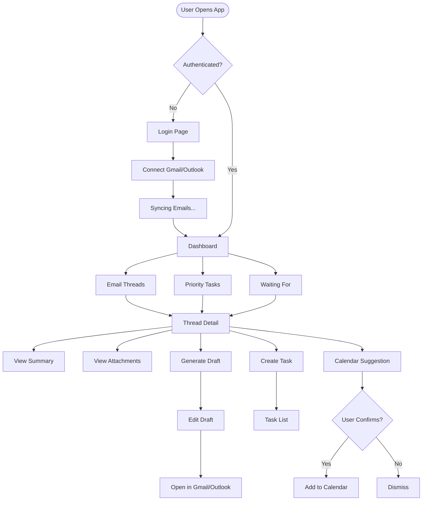

# SortMail — UI/UX Specification

---

## Screen Inventory

| Screen | Priority | Owner | Status |
|--------|----------|-------|--------|
| Login / Connect | P0 | TBD | Pending |
| Dashboard | P0 | TBD | Pending |
| Thread View | P0 | TBD | Pending |
| Task List | P1 | TBD | Pending |
| Draft Panel | P1 | TBD | Pending |
| Settings | P2 | TBD | Pending |

---

## User Flow



---

## Wireframe Layouts

### 1. Login / Connect Account

```
┌─────────────────────────────────────────────────────────────┐
│                                                             │
│                      🔮 SortMail                            │
│                                                             │
│              Your AI-powered email brain                    │
│                                                             │
│         ┌─────────────────────────────────────┐            │
│         │   🔵 Continue with Google           │            │
│         └─────────────────────────────────────┘            │
│                                                             │
│         ┌─────────────────────────────────────┐            │
│         │   📘 Continue with Outlook          │            │
│         └─────────────────────────────────────┘            │
│                                                             │
│             We never send emails on your behalf             │
│                                                             │
└─────────────────────────────────────────────────────────────┘
```

---

### 2. Dashboard

```
┌───────────────────────────────────────────────────────────────────────┐
│ 🔮 SortMail          [Search...]                    [⚙️] [👤 Profile] │
├────────────┬──────────────────────────────────────────────────────────┤
│            │                                                          │
│ 📊 Dashboard│           📋 PRIORITY TASKS                             │
│ 📬 Inbox   │     ┌────────────────────────────────────────────────┐  │
│ ✅ Tasks   │     │ 🔴 Reply to Sarah - Contract Review            │  │
│ ⏳ Waiting │     │    High: CEO + deadline tomorrow              │  │
│ ⚙️ Settings│     └────────────────────────────────────────────────┘  │
│            │     ┌────────────────────────────────────────────────┐  │
│            │     │ 🟡 Review proposal from Acme Corp              │  │
│            │     │    Medium: attachment needs review             │  │
│            │     └────────────────────────────────────────────────┘  │
│            │     ┌────────────────────────────────────────────────┐  │
│            │     │ 🟢 FYI: Team standup notes                     │  │
│            │     │    Low: no action required                     │  │
│            │     └────────────────────────────────────────────────┘  │
│            │                                                          │
│            │           ⏳ WAITING FOR REPLY                          │
│            │     ┌────────────────────────────────────────────────┐  │
│            │     │ 📨 John @ BigClient - 5 days waiting           │  │
│            │     │    [📝 Draft Follow-up]                         │  │
│            │     └────────────────────────────────────────────────┘  │
│            │                                                          │
├────────────┴──────────────────────────────────────────────────────────┤
│ 📈 12 emails processed • 3 tasks pending • 2 awaiting reply          │
└───────────────────────────────────────────────────────────────────────┘
```

---

### 3. Thread View

```
┌───────────────────────────────────────────────────────────────────────┐
│ ← Back to Dashboard                                    [⭐] [🗑️]      │
├───────────────────────────────────────────────────────────────────────┤
│                                                                       │
│  📧 Contract Review - Final Terms                                     │
│  From: Sarah Chen <sarah@client.com>                                  │
│  Thread: 4 messages                                                   │
│                                                                       │
├───────────────────────────────────────────────────────────────────────┤
│                                                                       │
│  🧠 EXECUTIVE SUMMARY                                                 │
│  ┌─────────────────────────────────────────────────────────────────┐ │
│  │ Sarah sent the final contract terms and needs your approval     │ │
│  │ by Friday EOD. Key changes: payment terms moved to NET 30,      │ │
│  │ liability cap increased to $500K.                               │ │
│  │                                                                  │ │
│  │ 📌 Main Ask: Approve or request changes                         │ │
│  │ ⏰ Deadline: Friday, Jan 24                                      │ │
│  │ 🏷️ Intent: ACTION_REQUIRED                                       │ │
│  └─────────────────────────────────────────────────────────────────┘ │
│                                                                       │
├───────────────────────────────────────────────────────────────────────┤
│                                                                       │
│  📎 ATTACHMENTS (2)                                                   │
│  ┌──────────────────────────────┐ ┌──────────────────────────────┐   │
│  │ 📄 Contract_ClientA_Jan24.pdf│ │ 📊 Pricing_Schedule_v2.xlsx │   │
│  │ 12 pages • Key terms doc     │ │ 3 sheets • Budget breakdown  │   │
│  │ [View Summary] [Download]    │ │ [View Summary] [Download]    │   │
│  └──────────────────────────────┘ └──────────────────────────────┘   │
│                                                                       │
├───────────────────────────────────────────────────────────────────────┤
│                                                                       │
│  📝 ACTIONS                                                           │
│  ┌─────────────────────┐ ┌─────────────────────┐ ┌────────────────┐  │
│  │ 💬 Generate Reply   │ │ ✅ Create Task      │ │ 📅 Add to Cal  │  │
│  └─────────────────────┘ └─────────────────────┘ └────────────────┘  │
│                                                                       │
├───────────────────────────────────────────────────────────────────────┤
│                                                                       │
│  📜 FULL THREAD                                                       │
│  ┌─────────────────────────────────────────────────────────────────┐ │
│  │ ▼ Sarah Chen - Today 2:30 PM                                    │ │
│  │   Hi, please find the final contract attached...                │ │
│  ├─────────────────────────────────────────────────────────────────┤ │
│  │ ▶ You - Yesterday 4:15 PM                                       │ │
│  │   Thanks Sarah, I'll review and get back to you...             │ │
│  └─────────────────────────────────────────────────────────────────┘ │
│                                                                       │
└───────────────────────────────────────────────────────────────────────┘
```

---

### 4. Draft Panel (Slide-over)

```
┌─────────────────────────────────────────────────────────────┐
│  ✏️ DRAFT REPLY                              [×] Close      │
├─────────────────────────────────────────────────────────────┤
│                                                             │
│  Tone: [Brief] [Normal ●] [Formal]                         │
│                                                             │
│  ┌─────────────────────────────────────────────────────┐   │
│  │ Hi Sarah,                                           │   │
│  │                                                     │   │
│  │ Thank you for sending over the final contract.     │   │
│  │ I've reviewed the updated terms and the changes    │   │
│  │ look good.                                          │   │
│  │                                                     │   │
│  │ [Confirm approval / Request specific change]       │   │
│  │                                                     │   │
│  │ I'll have this finalized by Friday EOD as          │   │
│  │ requested.                                          │   │
│  │                                                     │   │
│  │ Best,                                               │   │
│  │ [Your name]                                         │   │
│  └─────────────────────────────────────────────────────┘   │
│                                                             │
│  ⚠️ Placeholders detected: 1                                │
│                                                             │
│  ┌────────────────┐ ┌────────────────────────────────┐     │
│  │ 🔄 Regenerate  │ │ 📤 Open in Gmail               │     │
│  └────────────────┘ └────────────────────────────────┘     │
│                                                             │
└─────────────────────────────────────────────────────────────┘
```

---

### 5. Task List View

```
┌───────────────────────────────────────────────────────────────────────┐
│ ✅ TASKS                              Filter: [All ▼] [+ New Task]    │
├───────────────────────────────────────────────────────────────────────┤
│                                                                       │
│  🔴 DO NOW                                                            │
│  ┌─────────────────────────────────────────────────────────────────┐ │
│  │ □ Reply to Sarah - Contract Review          📅 Fri    ⚡ Quick  │ │
│  │   High: CEO + deadline tomorrow + waiting 3 days               │ │
│  └─────────────────────────────────────────────────────────────────┘ │
│                                                                       │
│  🟡 DO TODAY                                                          │
│  ┌─────────────────────────────────────────────────────────────────┐ │
│  │ □ Review Acme proposal                      📅 Mon    🧠 Deep   │ │
│  │   Medium: attachment pending review                            │ │
│  ├─────────────────────────────────────────────────────────────────┤ │
│  │ □ Schedule sync with marketing              📅 Today  ⚡ Quick  │ │
│  │   Medium: scheduling request                                   │ │
│  └─────────────────────────────────────────────────────────────────┘ │
│                                                                       │
│  🟢 CAN WAIT                                                          │
│  ┌─────────────────────────────────────────────────────────────────┐ │
│  │ ☑ Review team standup notes                 📅 —      ⚡ Quick  │ │
│  │   Low: FYI only                                                │ │
│  └─────────────────────────────────────────────────────────────────┘ │
│                                                                       │
└───────────────────────────────────────────────────────────────────────┘
```

---

### 6. Calendar Suggestion Modal

```
┌─────────────────────────────────────────────────────────────┐
│                    📅 CALENDAR SUGGESTION                   │
├─────────────────────────────────────────────────────────────┤
│                                                             │
│  We detected a meeting or deadline in this email:           │
│                                                             │
│  ┌─────────────────────────────────────────────────────┐   │
│  │ 📌 "Tuesday at 2pm works for the sync call"         │   │
│  └─────────────────────────────────────────────────────┘   │
│                                                             │
│  Would you like to add this to your calendar?               │
│                                                             │
│  Title:    [ Sync call with Sarah               ]           │
│  Date:     [ Tuesday, Jan 21, 2026              ]           │
│  Time:     [ 2:00 PM                            ]           │
│  Duration: [ 30 minutes               ▼]                    │
│                                                             │
│  ┌────────────────┐ ┌────────────────────────────────┐     │
│  │ ✗ Dismiss      │ │ ✓ Add to Google Calendar       │     │
│  └────────────────┘ └────────────────────────────────┘     │
│                                                             │
│  ⚠️ We'll open your calendar — we never auto-book           │
│                                                             │
└─────────────────────────────────────────────────────────────┘
```

---

## Component Hierarchy

```
App
├── LoginPage
│   ├── Logo
│   ├── GoogleAuthButton
│   └── OutlookAuthButton
│
├── DashboardLayout
│   ├── Sidebar
│   │   ├── NavItem (Dashboard)
│   │   ├── NavItem (Inbox)
│   │   ├── NavItem (Tasks)
│   │   ├── NavItem (Waiting)
│   │   └── NavItem (Settings)
│   ├── Header
│   │   ├── SearchBar
│   │   ├── SettingsButton
│   │   └── UserMenu
│   └── MainContent
│       ├── DashboardPage
│       │   ├── PriorityList
│       │   │   └── TaskCard (multiple)
│       │   ├── WaitingForList
│       │   │   └── WaitingCard (multiple)
│       │   └── QuickStats
│       │
│       ├── ThreadPage
│       │   ├── ThreadHeader
│       │   ├── ExecutiveSummary
│       │   ├── AttachmentGrid
│       │   │   └── AttachmentCard (multiple)
│       │   ├── ActionBar
│       │   ├── ThreadMessages
│       │   │   └── MessageCard (multiple)
│       │   └── DraftPanel (slide-over)
│       │       ├── ToneSelector
│       │       ├── DraftEditor
│       │       └── ActionButtons
│       │
│       ├── TasksPage
│       │   ├── TaskFilters
│       │   ├── TaskSection (Do Now)
│       │   ├── TaskSection (Do Today)
│       │   └── TaskSection (Can Wait)
│       │
│       └── SettingsPage
│           ├── AccountSettings
│           ├── VIPDomains
│           └── NotificationPrefs
│
└── Modals
    ├── CalendarSuggestionModal
    ├── CreateTaskModal
    └── ConfirmationModal
```

---

## Design System Tokens

### Colors

```css
/* Primary */
--color-primary: #6366f1;      /* Indigo */
--color-primary-hover: #4f46e5;

/* Priority */
--color-priority-high: #ef4444;   /* Red */
--color-priority-medium: #f59e0b; /* Amber */
--color-priority-low: #22c55e;    /* Green */

/* Neutral */
--color-bg: #0f172a;           /* Slate 900 */
--color-surface: #1e293b;      /* Slate 800 */
--color-border: #334155;       /* Slate 700 */
--color-text: #f8fafc;         /* Slate 50 */
--color-text-muted: #94a3b8;   /* Slate 400 */
```

### Typography

```css
--font-sans: 'Inter', system-ui, sans-serif;
--font-mono: 'JetBrains Mono', monospace;

--text-xs: 0.75rem;    /* 12px */
--text-sm: 0.875rem;   /* 14px */
--text-base: 1rem;     /* 16px */
--text-lg: 1.125rem;   /* 18px */
--text-xl: 1.25rem;    /* 20px */
--text-2xl: 1.5rem;    /* 24px */
```

### Spacing

```css
--space-1: 0.25rem;   /* 4px */
--space-2: 0.5rem;    /* 8px */
--space-3: 0.75rem;   /* 12px */
--space-4: 1rem;      /* 16px */
--space-6: 1.5rem;    /* 24px */
--space-8: 2rem;      /* 32px */
```

---

## Figma Assignment

| Screen | Assigned To | Deadline |
|--------|-------------|----------|
| Login + Connect | Designer A | Day 3 |
| Dashboard | Designer A | Day 4 |
| Thread View | Designer B | Day 4 |
| Task List | Designer B | Day 5 |
| Modals & Components | Designer A + B | Day 5 |
